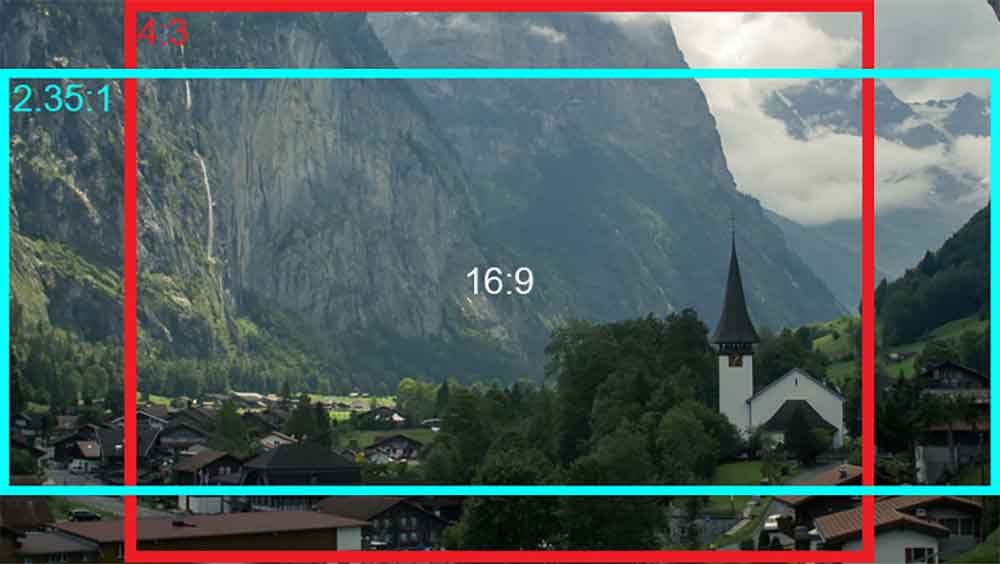

# Engineering Blog

NOTE: This is a work in progress. The blog is not yet publically available and a solution for hosting the blog is yet to be decided on.

This is the source code for the https://diemobiliar.github.io/[Mobi Engineering Blog]. The idea of this blog is to:

* share our ideas and knowledge with the public, start discussions and get feedback
* show-case the interesting things we do in IT at Mobiliar
* document our learnings and experiences
* position ourselves as a modern, forward-thinking company and an attractive employer of engineering talent
* offer our engineers a platform to showcase their work and share their knowledge

The blog is built from the source files in content/ with https://gohugo.io/[Hugo] and published as a static site.

Anyone can contribute to the blog. Just follow the guidelines below to create a new post and open a pull request with your changes.

## Contributing to the blog

### Preqrequisites

Please see xref:CONTRIBUTING.adoc[CONTRIBUTING.adoc] for instructions for the initial setup.

### Creating a new post

[,bash]
Just run:

[,bash]
----
hugo new blog/my-title.md
----

The generated file will already have the mandatory fields for you to start filling in. Your new post will be marked as a draft. In order to see it, you need to run hugo with the `--buildDrafts` flag: `hugo server --buildDrafts`.
When you're ready to publish your post, remove the `draft: true` line from the post's https://gohugo.io/content-management/front-matter/[front matter].

#### The importance of images

Blog posts with images are said to get 2.3x more engagement than those without - so please include an image in your post! Since a suitable image isn't always obvious for abstract technical topics, we encourage you to use AI-generated images to visualise your topic in a fun and abstract way. For inspiration, please read this blog post: https://deephaven.io/blog/2022/08/08/AI-generated-blog-thumbnails/[I replaced all our blog thumbnails using DALL·E 2].

Try using one of these AI-generated image services:

* https://www.midjourney.com/[Midjourney]
* https://labs.openai.com/[DALL·E]
* https://stablediffusionweb.com/[Stable Diffusion]

TIP: https://www.windowscentral.com/how-crop-image-windows-10[Crop your image to a 16:9 aspect ratio], so it fits nicely in the blog post.

##### Adding images to a post

You can add images in two ways: as a cover image / thumbnail (most important) and as a regular image in the post. The cover image will be added automatically to the post's front matter when you run the `hugo new` command above, just replace the placeholder path with your own.

To use an image in a post, use regular markdown syntax:

[,markdown]
----

----

### Publishing your post

When you're ready, remove the `draft: true` line from the post's front matter and open a pull request with your changes. The pull request will be reviewed by the blog's maintainers and merged once approved.

Once merged, the blog will be automatically published and deployed by the pipeline.
